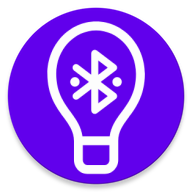
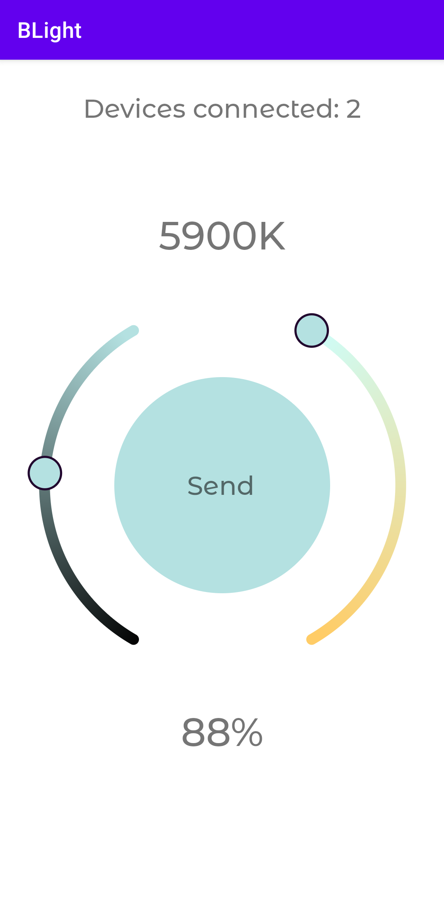

<div id="top"></div>


<!-- PROJECT LOGO -->
<br />
<div align="center">
  <a href="https://github.com/AndrewLaptev/ble_light_mobile">
    
  </a>

<h3 align="center">BLight</h3>

  <p align="center">
    Мобильное приложение для мультиканального управления умными лампами
    <br />
      <a href="https://github.com/AndrewLaptev/ble_light_esp32"><strong>ble_light_esp32</strong></a>
    <br />
  </p>
</div>


<!-- TABLE OF CONTENTS -->
<details>
  <summary>Table of Contents</summary>
  <ol>
    <li>
      <a href="#about-the-project">About The Project</a>
      <ul>
        <li><a href="#built-with">Built With</a></li>
      </ul>
    </li>
    <li>
      <a href="#getting-started">Getting Started</a>
      <ul>
        <li><a href="#prerequisites">Prerequisites</a></li>
        <li><a href="#installation">Installation</a></li>
      </ul>
    </li>
    <li><a href="#usage">Usage</a></li>
    <li><a href="#roadmap">Roadmap</a></li>
    <li><a href="#contributing">Contributing</a></li>
    <li><a href="#license">License</a></li>
    <li><a href="#contact">Contact</a></li>
    <li><a href="#acknowledgments">Acknowledgments</a></li>
  </ol>
</details>


<!-- ABOUT THE PROJECT -->
## About

Данное мобильное приложение предназначено для ручного беспроводного управления сразу несколькими умными лампами в определенной области действия. В качестве управляющего контроллера лампы используется микроконтроллер ESP32 с прошивкой [BLightESP32](https://github.com/AndrewLaptev/ble_light_esp32). Управление осуществляется через изменение цветовой температуры ламп, а также их яркости.

## Usage

### Setup

### User mode

Для использования приложения вам нужно будет дать разрешение на доступ приложения к Bluetooth и вашему местоположению на устройстве

1) Запускаем приложение:
<p align="center">
  <a href="https://github.com/AndrewLaptev/ble_light_mobile">
      
  </a>
</p>

2) Выставляем ползунок `RSSI threshold` на необходимое значение, которое измеряется в `dBm` и интерпретирует расстояние до лампы. Чем больше по модулю будет показание `RSSI threshold`, тем больше будет область поиска ламп. После чего нажимаем кнопку поиска:
<p align="center">
  <a href="https://github.com/AndrewLaptev/ble_light_mobile">
      
  </a>
</p>

3) Если лампы будут найдены, то на экране отобразится панель управления:
<p align="center">
  <a href="https://github.com/AndrewLaptev/ble_light_mobile">
      
  </a>
</p>

4) С помощью ползунков выбираем нужные значения цветовой температуры и яркости, после чего нажимаем кнопку `Send`, которая отправляет выбранный режим на все подключенные лампы:
<p align="center">
  <a href="https://github.com/AndrewLaptev/ble_light_mobile">
      
  </a>
</p>

5) Чтобы отключиться от ламп, достаточно просто перейти на главный экран приложения через кнопку действия мобильного телефона `Назад`

### Developer mode

В приложении также имеется продвинутый режим использования, который позволяет видеть все ближайшие устройства Bluetooth, а также их RSSI в реальном времени, сервисы и значения характеристик

1) Чтобы перейти в продвинутый режим, нужно на главном экране приложения справа сверху нажать значок выпадающего меню и выбрать пункт `Developer mode`:
<p align="center">
  <a href="https://github.com/AndrewLaptev/ble_light_mobile">
      
  </a>
</p>

2) После нажатия кнопки `Scan` на экране появится список из всех доступных Bluetooth устройств поблизости с отображением их имен, MAC-адресов и уровней RSSI:
<p align="center">
  <a href="https://github.com/AndrewLaptev/ble_light_mobile">
      
  </a>
</p>

3) При нажатии на устройство из списка отобразится диалоговое окное, которое содержит имя устройства, его адрес, тип Bluetooth устройства, а также конопки подключения и выхода из диалогового окна:
<p align="center">
  <a href="https://github.com/AndrewLaptev/ble_light_mobile">
      
  </a>
</p>

4) После удачного подключения к устройству на экране отобразятся все его сервисы и характеристики. Узнать значения характеристики можно нажав на нее, также отобразится тип характеристики во всплывающем сообщении (`Readable`, `Writeble` и т.д.). Если характеристика `Writeble`, то появится диалоговое окно для записи значения:
<p align="center">
  <a href="https://github.com/AndrewLaptev/ble_light_mobile">
      
  </a>
</p>

5) В интерфейсе поиска устройств рядом с кнопкой `Scan` также есть еще кнопки `Filter on/off` и `Multiple connect`. Первая из них включает фильтр при поиске устройств и отображает только те устройства, на которых установлена заранее настроенная прошивка BLightESP32, вторая кнопка запускает множественное подключение ко всем найденным устройствам с прошивкой BLightESP32:
<p align="center">
  <a href="https://github.com/AndrewLaptev/ble_light_mobile">
      
  </a>
</p>

<p align="right">(<a href="#top">back to top</a>)</p>


### Built With
* [![Android Studio][android-studio-shield]][android-studio-url]
* [![Pikolo][pikolo-shield]][pikolo-url]

<p align="right">(<a href="#top">back to top</a>)</p>


<!-- GETTING STARTED -->
## Getting Started

This is an example of how you may give instructions on setting up your project locally.
To get a local copy up and running follow these simple example steps.

### Prerequisites

This is an example of how to list things you need to use the software and how to install them.
* npm
  ```sh
  npm install npm@latest -g
  ```

### Installation

1. Get a free API Key at [https://example.com](https://example.com)
2. Clone the repo
   ```sh
   git clone https://github.com/github_username/repo_name.git
   ```
3. Install NPM packages
   ```sh
   npm install
   ```
4. Enter your API in `config.js`
   ```js
   const API_KEY = 'ENTER YOUR API';
   ```

<p align="right">(<a href="#top">back to top</a>)</p>


<!-- USAGE EXAMPLES -->
## Usage

Use this space to show useful examples of how a project can be used. Additional screenshots, code examples and demos work well in this space. You may also link to more resources.

_For more examples, please refer to the [Documentation](https://example.com)_

<p align="right">(<a href="#top">back to top</a>)</p>


<!-- ROADMAP -->
## Roadmap

- [ ] Feature 1
- [ ] Feature 2
- [ ] Feature 3
    - [ ] Nested Feature

See the [open issues](https://github.com/github_username/repo_name/issues) for a full list of proposed features (and known issues).

<p align="right">(<a href="#top">back to top</a>)</p>


<!-- CONTRIBUTING -->
## Contributing

Contributions are what make the open source community such an amazing place to learn, inspire, and create. Any contributions you make are **greatly appreciated**.

If you have a suggestion that would make this better, please fork the repo and create a pull request. You can also simply open an issue with the tag "enhancement".
Don't forget to give the project a star! Thanks again!

1. Fork the Project
2. Create your Feature Branch (`git checkout -b feature/AmazingFeature`)
3. Commit your Changes (`git commit -m 'Add some AmazingFeature'`)
4. Push to the Branch (`git push origin feature/AmazingFeature`)
5. Open a Pull Request

<p align="right">(<a href="#top">back to top</a>)</p>


<!-- LICENSE -->
## License

Distributed under the MIT License. See `LICENSE.txt` for more information.

<p align="right">(<a href="#top">back to top</a>)</p>


<!-- CONTACT -->
## Contact

Your Name - [@twitter_handle](https://twitter.com/twitter_handle) - email@email_client.com

Project Link: [https://github.com/github_username/repo_name](https://github.com/github_username/repo_name)

<p align="right">(<a href="#top">back to top</a>)</p>


<!-- ACKNOWLEDGMENTS -->
## Acknowledgments

* []()
* []()
* []()

<p align="right">(<a href="#top">back to top</a>)</p>


<!-- MARKDOWN LINKS & IMAGES -->
<!-- https://www.markdownguide.org/basic-syntax/#reference-style-links -->
[android-studio-shield]: https://img.shields.io/badge/Android%20Studio-000000?style=for-the-badge&logo=androidstudio
[android-studio-url]: https://developer.android.com/studio
[pikolo-shield]: https://img.shields.io/badge/Pikolo-7F52FF?style=for-the-badge
[pikolo-url]: https://github.com/Madrapps/Pikolo
