<div id="top"></div>


<!-- PROJECT LOGO -->
<br />
<div align="center">
  <a href="https://github.com/AndrewLaptev/ble_light_mobile">
    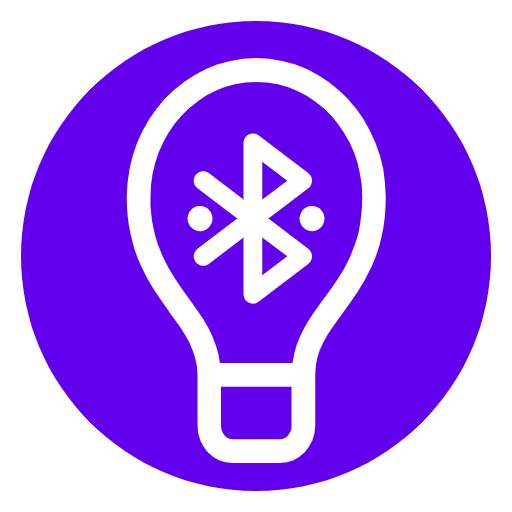
  </a>

<h3 align="center">BLight</h3>

  <p align="center">
    Software module for localization of owners of digital assistants according to mobile device data
  </p>
</div>


<!-- ABOUT THE PROJECT -->
## About

This mobile application is designed for manual wireless control of several nearby smart lamps at once in a certain area of action, which is set by the user. The ESP 32 microcontroller with firmware [BLightESP32](https://github.com/AndrewLaptev/ble_light_esp32) is used as the control controller of the lamp. The control is carried out by changing the color temperature of the lamps, as well as their brightness.

### Built With
* [![Android Studio][android-studio-shield]][android-studio-url]
* [![Pikolo][pikolo-shield]][pikolo-url]

### Requirements
* Android 10 and higher
* Bluetooth 5.0

<!-- GETTING STARTED -->
## Getting Started

Here is a description of how you can install and run the application from the source files

### Prerequisites

* Android Studio (2021.1.1 and higher)

### Installation

1. Cloning the repository
   ```bash
   git clone https://github.com/AndrewLaptev/ble_light_mobile
   ```
2. Opening the project in Android Studio
3. We build the project and upload it to the phone (the application will not work in the emulator)

<p align="right">(<a href="#top">back to top</a>)</p>

<!-- USAGE -->
## Usage

<details>
<summary><h4>Step-by-step instruction</h4></summary>

  ### Setup

  Before connecting the application to lamps with BLightESP32 firmware, you can configure it in the `Settings` section (drop-down menu on the main screen):
  <p align="center">
    <a href="https://github.com/AndrewLaptev/ble_light_mobile">
        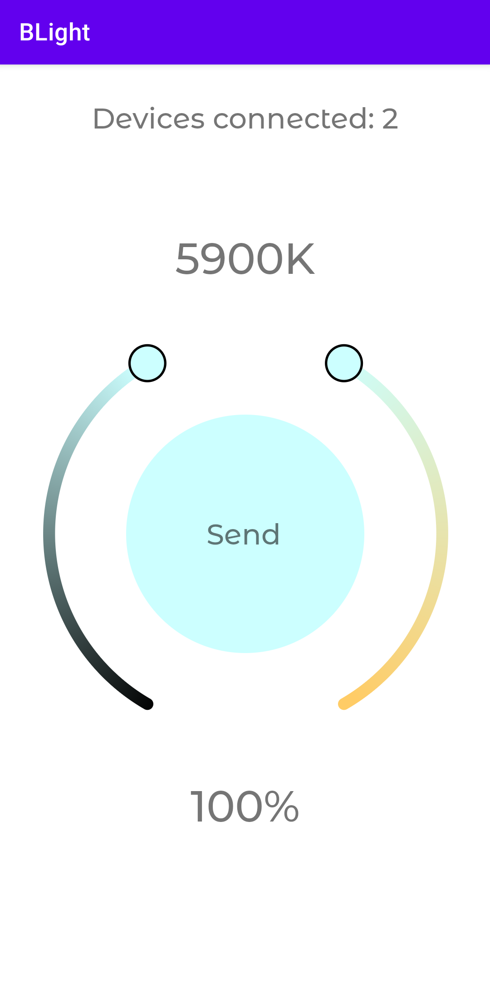
    </a>
  </p>

  ### User mode

  To use the app, you will need to give permission for the app to access Bluetooth and your location on the device

  1) Launching the application:
  <p align="center">
    <a href="https://github.com/AndrewLaptev/ble_light_mobile">
        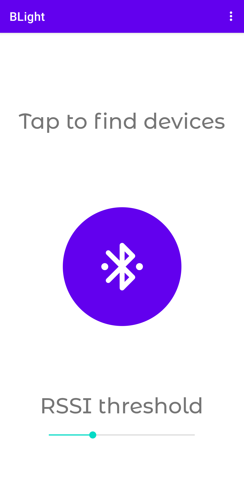
    </a>
  </p>

  2) We set the slider `RSSI threshold` to the required value, which is measured in `dBm` and interprets the distance to the lamp. The larger the `RSSI threshold` reading is modulo, the larger the lamp search area will be. Then click the search button:
  <p align="center">
    <a href="https://github.com/AndrewLaptev/ble_light_mobile">
        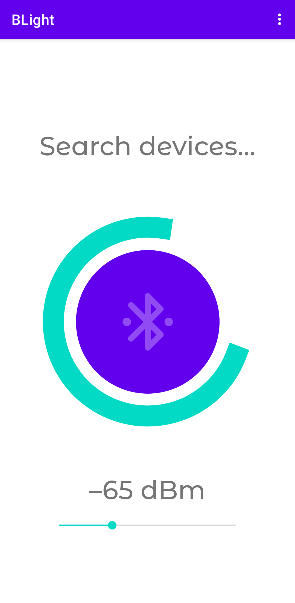
    </a>
  </p>

  3) If the lamps are found, the control panel will be displayed on the screen:
  <p align="center">
    <a href="https://github.com/AndrewLaptev/ble_light_mobile">
        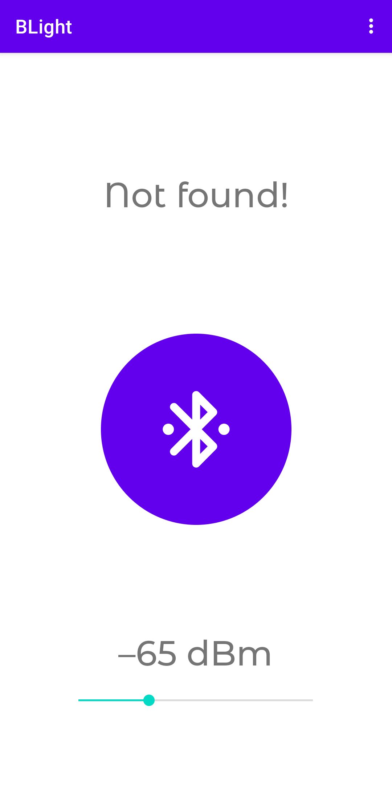
    </a>
  </p>

  4) Using the sliders, select the desired values of color temperature and brightness, then press the `Send` button, which sends the selected mode to all connected lamps:
  <p align="center">
    <a href="https://github.com/AndrewLaptev/ble_light_mobile">
        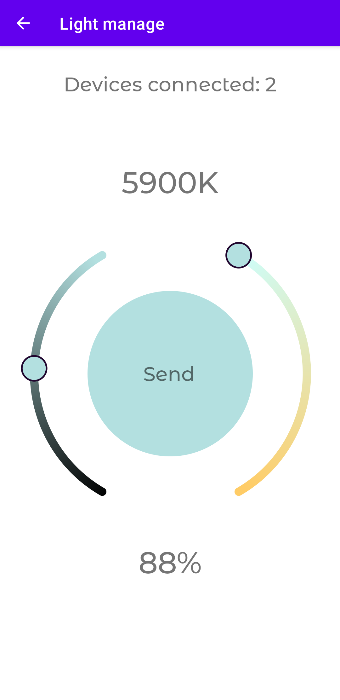
    </a>
  </p>

  5) To disconnect from the lamps, just go to the main screen of the application via the mobile phone action button `Back`

  ### Developer mode

  The application also has an advanced usage mode that allows you to see all the nearest Bluetooth devices, as well as their RSSI in real time, services and performance values.

  1) To switch to advanced mode, you need to click the drop-down menu icon on the top right of the main application screen and select `Developer mode`:
  <p align="center">
    <a href="https://github.com/AndrewLaptev/ble_light_mobile">
        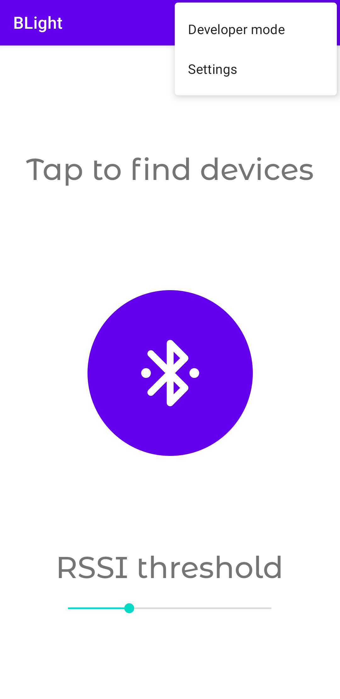
    </a>
  </p>

  2) After pressing the `Scan` button, a list of all available Bluetooth devices nearby will appear on the screen with their names, MAC addresses and RSSI levels displayed:
  <p align="center">
    <a href="https://github.com/AndrewLaptev/ble_light_mobile">
        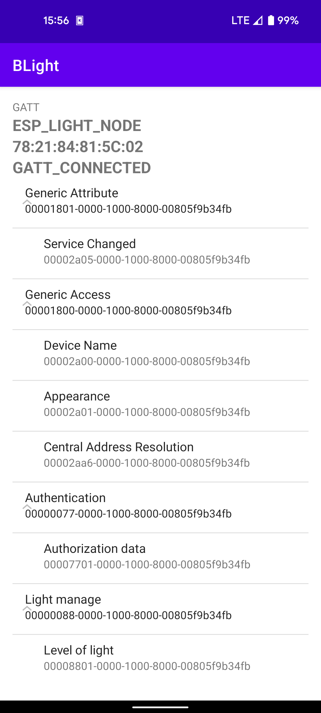
    </a>
  </p>

  3) Clicking on a device from the list will display a dialog box that contains the name of the device, its address, the type of Bluetooth device, as well as the connection and exit buttons of the dialog box:
  <p align="center">
    <a href="https://github.com/AndrewLaptev/ble_light_mobile">
        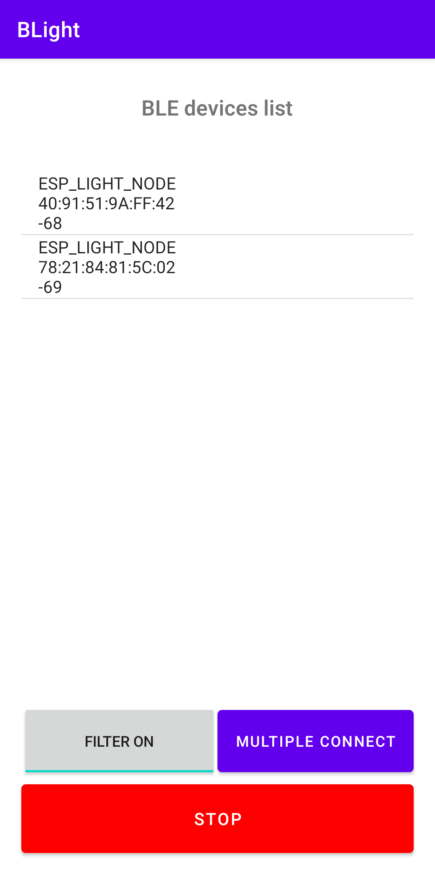
    </a>
  </p>

  4) After successfully connecting to the device, all its services and characteristics will be displayed on the screen. You can find out the values of the characteristic by clicking on it, the type of characteristic will also be displayed in a pop-up message (`Readable`, `Writeble`, etc.). If the characteristic is `Writeble`, a dialog box will appear to record the value:
  <p align="center">
    <a href="https://github.com/AndrewLaptev/ble_light_mobile">
        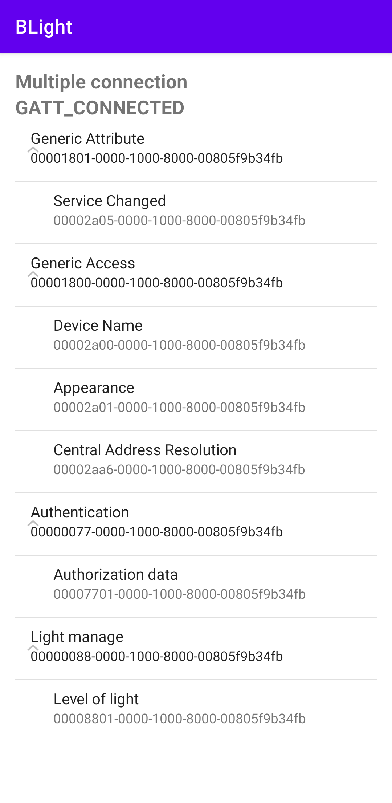
    </a>
  </p>

  5) In the device search interface, there are also `Filter on/off` and `Multiple connect` buttons next to the `Scan` button. The first of them includes a filter when searching for devices and displays only those devices on which the pre-configured BLightESP32 firmware is installed, the second button starts multiple connection to all found devices with BLightESP32 firmware:
  <p align="center">
    <a href="https://github.com/AndrewLaptev/ble_light_mobile">
        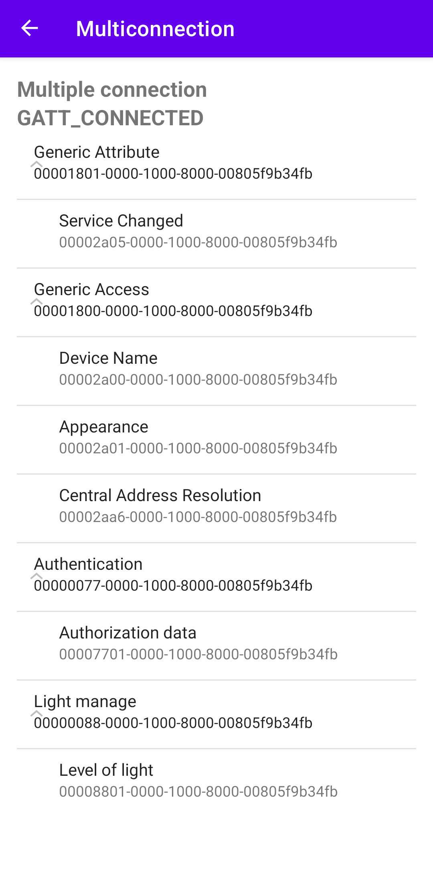
    </a>
  </p>

  <p align="right">(<a href="#top">back to top</a>)</p>
</details>

<!-- DOCUMENTATION -->
## Documentation

This section describes the functional modules of the application and the classes (Activity) that they consist of.

Only methods that contain application-specific logic are considered, i.e. standard methods `onCreate()`, `onResume()`, etc., **not carrying** specific logic in themselves, will not be described.

Classes, methods and functions (or part of the method) of rendering the application interface are not considered in detail, because this is a simple basic interface made for a prototype.

<details>
  <summary><h3>ble_light</h3></summary>
  This functional module is the main one in the operation of the application and implements the user (User mode) mode of operation of the application.
  
  #### MainActivity
  The main class of the application, it contains entrypoint, access to settings, advanced mode, and it is from it that device scanning is started with subsequent connection
  
  *Protected* methods:
  * `onCreate` - calls private methods for initializing, configuring and scanning Bluetooth, as well as access rights for Bluetooth and checking for BLE support.
  
  *Private* methods:
  * `getBluetoothAdapterAndLeScanner` - initializes objects of the `Bluetooth Adapter` and `Bluetooth Le Scanner` classes
  * `scanBleDevices` - starts scanning Bluetooth devices with a certain `scan_period` time, passes a list of device addresses to the `LightManageActivity` class
  * `meanRSSI` - calculates the average value of the RSSI signal strength from the input array of values
  * `loadSettings` - loads the settings (`scan_period`) from `root_preferences.xml`
  
  *Inner* classes:
  * `Kalman` - the class implementing the Kalman filter has one *public* method `filter(int init_rssi, ArrayList<Integer> rssi_list)`, which directly performs filtering
  
  #### BluetoothLeService
  A class containing all the necessary methods for creating and managing Bluetooth connections.
  
  *Public* methods:
  * `initialize` - initializes an object of the `BluetoothAdapter` class
  * `connect` - connects a Bluetooth device to GATT at the specified MAC address
  * `multiconnect` - connects to several GATT Bluetooth devices at once using the specified list of MAC addresses
  * `disconnect` - disconnects from one or several Bluetooth devices at once
  * `сlose` - closes the connection/GATT connections of Bluetooth devices
  * `readCharacteristic` - reads the value of a certain GATT characteristic of one Bluetooth device or several at once
  * `writeCharacteristic` - writes a value to a specific GATT characteristic of one Bluetooth device or several at once
  * `setCharacteristicNotification` - sets or disables notification for a specific GATT characteristic of one Bluetooth device or several at once
  * `getSupportedGattServices` - returns a list of available GATT Bluetooth device services
  
  *Private* methods:
  * `loadSettings` - loads the settings (`reconnection_attempts`) from `root_preferences.xml`
  
  *Inner* classes:
  * `BluetoothGattExt` - class that is an extension of the `BluetoothGatt` class. Connects the Bluetooth device and the `BluetoothGatt` object more closely, because the standard `BluetoothGatt` can connect to multiple devices, which does not provide data exchange with multiple devices at once.

  #### LightManageActivity
  A class responsible for authentication and control of light modes on a connected Bluetooth device (services `Authentication` and `Light manage`). Authentication is only needed to access the values entry in the `Level of light` characteristic for controlling light modes, i.e. you can connect to the GATT of the BLightESP32 device and see its services and characteristics, but without authentication (`access_token`) through the `Authorization data` characteristic, it will be impossible to control the light mode.
  
  *Protected* methods:
  * `onCreate` - performs initial calculations of the step of changing the light mode based on the selected settings, initializes the visual interface for selecting the mode, initializes the connection to Bluetooth devices BLightESP32
  
  *Private* methods:
  * `initServiceConnection` - connects to Bluetooth devices, also defines a callback method for reconnecting if it is not possible to connect the first time
  * `authDataSending` - passes authentication data (`access_token`) to the `Authorization data` characteristic for future access to recording light mode values in the `Level of light` characteristic
  * `loadSettings` - loads the settings (`access_token`, `effect_color_temp_min_key`, `effect_color_temp_max_key`) from `root_preferences.xml`
 
  #### SettingsActivity
  A class that implements an interface for user interaction with application settings via `root_preferences.xml`, allows you to reset the settings to the default values. Basically, this class contains visual functionality, so it will not be described in detail.

</details>


<details>
  <summary><h3>dev_mode</h3></summary>
  This module implements the advanced mode (Developer mode) of using the application.
  
  #### MainActivityDev
  The main class for interacting with Bluetooth devices implements a graphical interface for representing all available devices within Bluetooth range.
  
  *Protected* methods:
  * `onCreate` - Calls private methods for initializing, configuring and scanning Bluetooh, defines callback functions for the `Filter ON/OFF` and `Multiple connect` buttons calls private methods for initializing, configuring and scanning Bluetooh, defines callback functions for the `Filter ON/OFF` and `Multiple connect` buttons
  
  *Private* methods:
  * `getBTDeviceType` - determines the type of the selected Bluetooth device before connecting directly
  * `getBluetoothAdapterAndLeScanner` - initializes objects of the `BluetoothAdapter` and `BluetoothLeScanner` classes
  * `scanLeDevice` - the `SCAN` button starts scanning devices until the `STOP` button is pressed
  
  *Inner* classes:
  * `BluetoothDeviceExt` - a class that is an extension of the `BluetoothDevice` class. Allows you to more closely link a Bluetooth device and its RSSI
  
  #### ConnectionActivityDev
  This class implements a mechanism for connecting to a Bluetooth device, similar to the `LightManageActivity` class, only for one device. Builds a graphical interface for direct interaction with the services and characteristics of the GATT device through text dialog boxes
  
  #### MultiConnectionActivityDev
  This class implements a mechanism for connecting to a Bluetooth device, similar to the `LightManageActivity` class, to several BLightESP32 devices at once. Builds a single graphical interface for direct interaction with GATT services and characteristics of all devices at once through text dialog boxes

</details>

<details>
  <summary><h3>gatt_attr</h3></summary>
  This module contains classes for storing collections (dictionaries) UUID GATT matches of services, characteristics, descriptors and their names.
  
  #### AllGattServices
  Contains a dictionary of service names and their corresponding UUIDs
  
  #### AllGattCharacteristics
  Contains a dictionary of feature names and their corresponding UUIDs
  
  #### AllGattDescriptors
  Contains a dictionary of descriptor names and their corresponding UUIDs
  
</details>
  
<details>
  <summary><h3>light_picker</h3></summary>
  This module contains the implementation of a graphical interface for selecting the light mode in the user mode (User mode) of the application. Implementation by modification of the library <a href="https://github.com/Madrapps/Pikolo"> Pikolo </a>

</details>

<p align="right">(<a href="#top">back to top</a>)</p>

<!-- ACKNOWLEDGMENTS -->
## Acknowledgments
The application was developed within the framework of the research project "Development of mechanisms for designing the processes of users' vital activity into the ecosystem of their digital assistants" No. 621308

<p align="right">(<a href="#top">back to top</a>)</p>

<!-- MARKDOWN LINKS & IMAGES -->
<!-- https://www.markdownguide.org/basic-syntax/#reference-style-links -->
[android-studio-shield]: https://img.shields.io/badge/Android%20Studio-000000?style=for-the-badge&logo=androidstudio
[android-studio-url]: https://developer.android.com/studio
[pikolo-shield]: https://img.shields.io/badge/Pikolo-7F52FF?style=for-the-badge
[pikolo-url]: https://github.com/Madrapps/Pikolo
