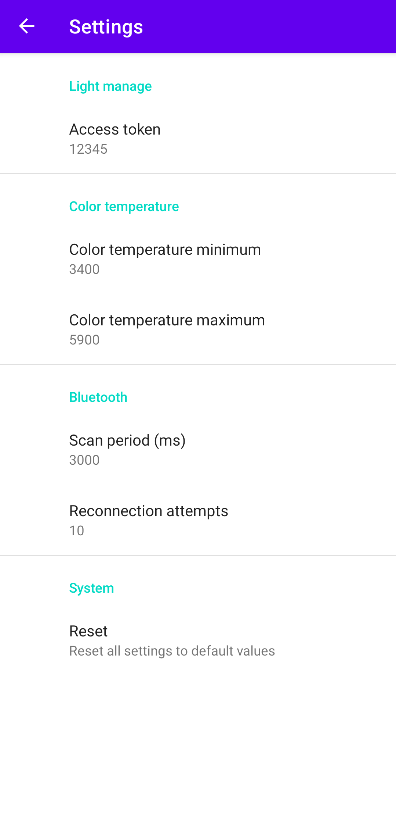
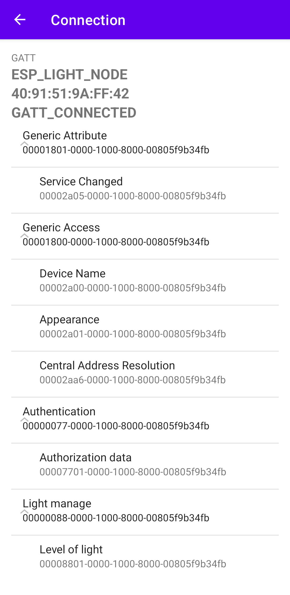

<div id="top"></div>


<!-- PROJECT LOGO -->
<br />
<div align="center">
  <a href="https://github.com/AndrewLaptev/ble_light_mobile">
    
  </a>

<h2 align="center">BLight</h2>

  <p align="center">
    Мобильное приложение для мультиканального управления умными лампами
    <br />
      <a href="https://github.com/AndrewLaptev/ble_light_esp32"><strong>ble_light_esp32</strong></a>
    <br />
  </p>
</div>


<!-- TABLE OF CONTENTS -->
<details>
  <summary>Table of Contents</summary>
  <ol>
    <li>
      <a href="#about-the-project">About The Project</a>
      <ul>
        <li><a href="#built-with">Built With</a></li>
      </ul>
    </li>
    <li>
      <a href="#getting-started">Getting Started</a>
      <ul>
        <li><a href="#prerequisites">Prerequisites</a></li>
        <li><a href="#installation">Installation</a></li>
      </ul>
    </li>
    <li><a href="#usage">Usage</a></li>
    <li><a href="#roadmap">Roadmap</a></li>
    <li><a href="#contributing">Contributing</a></li>
    <li><a href="#license">License</a></li>
    <li><a href="#contact">Contact</a></li>
    <li><a href="#acknowledgments">Acknowledgments</a></li>
  </ol>
</details>

<!-- ABOUT THE PROJECT -->
## About

Данное мобильное приложение предназначено для ручного беспроводного управления сразу несколькими умными лампами в определенной области действия. В качестве управляющего контроллера лампы используется микроконтроллер ESP32 с прошивкой [BLightESP32](https://github.com/AndrewLaptev/ble_light_esp32). Управление осуществляется через изменение цветовой температуры ламп, а также их яркости.

### Built With
* [![Android Studio][android-studio-shield]][android-studio-url]
* [![Pikolo][pikolo-shield]][pikolo-url]

<!-- USAGE -->
## Usage

<details>
<summary><h4>Step-by-step instruction</h4></summary>

  ### Setup

  Перед подключением приложения к лампам с прошивкой BLightESP32 можно произвести настройку в разделе `Settings` (выпадающее меню на главном экране):
  <p align="center">
    <a href="https://github.com/AndrewLaptev/ble_light_mobile">
        
    </a>
  </p>

  ### User mode

  Для использования приложения вам нужно будет дать разрешение на доступ приложения к Bluetooth и вашему местоположению на устройстве

  1) Запускаем приложение:
  <p align="center">
    <a href="https://github.com/AndrewLaptev/ble_light_mobile">
        
    </a>
  </p>

  2) Выставляем ползунок `RSSI threshold` на необходимое значение, которое измеряется в `dBm` и интерпретирует расстояние до лампы. Чем больше по модулю будет показание `RSSI threshold`, тем больше будет область поиска ламп. После чего нажимаем кнопку поиска:
  <p align="center">
    <a href="https://github.com/AndrewLaptev/ble_light_mobile">
        
    </a>
  </p>

  3) Если лампы будут найдены, то на экране отобразится панель управления:
  <p align="center">
    <a href="https://github.com/AndrewLaptev/ble_light_mobile">
        
    </a>
  </p>

  4) С помощью ползунков выбираем нужные значения цветовой температуры и яркости, после чего нажимаем кнопку `Send`, которая отправляет выбранный режим на все подключенные лампы:
  <p align="center">
    <a href="https://github.com/AndrewLaptev/ble_light_mobile">
        
    </a>
  </p>

  5) Чтобы отключиться от ламп, достаточно просто перейти на главный экран приложения через кнопку действия мобильного телефона `Назад`

  ### Developer mode

  В приложении также имеется продвинутый режим использования, который позволяет видеть все ближайшие устройства Bluetooth, а также их RSSI в реальном времени, сервисы и значения характеристик

  1) Чтобы перейти в продвинутый режим, нужно на главном экране приложения справа сверху нажать значок выпадающего меню и выбрать пункт `Developer mode`:
  <p align="center">
    <a href="https://github.com/AndrewLaptev/ble_light_mobile">
        
    </a>
  </p>

  2) После нажатия кнопки `Scan` на экране появится список из всех доступных Bluetooth устройств поблизости с отображением их имен, MAC-адресов и уровней RSSI:
  <p align="center">
    <a href="https://github.com/AndrewLaptev/ble_light_mobile">
        
    </a>
  </p>

  3) При нажатии на устройство из списка отобразится диалоговое окное, которое содержит имя устройства, его адрес, тип Bluetooth устройства, а также конопки подключения и выхода из диалогового окна:
  <p align="center">
    <a href="https://github.com/AndrewLaptev/ble_light_mobile">
        
    </a>
  </p>

  4) После удачного подключения к устройству на экране отобразятся все его сервисы и характеристики. Узнать значения характеристики можно нажав на нее, также отобразится тип характеристики во всплывающем сообщении (`Readable`, `Writeble` и т.д.). Если характеристика `Writeble`, то появится диалоговое окно для записи значения:
  <p align="center">
    <a href="https://github.com/AndrewLaptev/ble_light_mobile">
        
    </a>
  </p>

  5) В интерфейсе поиска устройств рядом с кнопкой `Scan` также есть еще кнопки `Filter on/off` и `Multiple connect`. Первая из них включает фильтр при поиске устройств и отображает только те устройства, на которых установлена заранее настроенная прошивка BLightESP32, вторая кнопка запускает множественное подключение ко всем найденным устройствам с прошивкой BLightESP32:
  <p align="center">
    <a href="https://github.com/AndrewLaptev/ble_light_mobile">
        
    </a>
  </p>

  <p align="right">(<a href="#top">back to top</a>)</p>
</details>

<!-- GETTING STARTED -->
## Getting Started

Здесь находится описание того, как можно установить и запустить приложение из исходных файлов

### Prerequisites

* Android Studio (2021.1.1 и выше)

### Installation

1. Клонируем репозиторий
   ```bash
   git clone https://github.com/AndrewLaptev/ble_light_mobile
   ```
2. Открываем проект в Android Studio
3. Выполняем сборку проекта и закачиваем его на телефон (в эмуляторе приложение работать не будет)

<p align="right">(<a href="#top">back to top</a>)</p>

<!-- DOCUMENTATION -->
## Documentation

В данном разделе описаны функциональные модули приложени и классы (Activity), из которых они состоят. 

Рассматриваются только методы, в которых содержится специфическая для данного приложения логика, т.е. стандартные методы `onCreate()`, `onResume()` и т.п., **не несущие** в себе специфической логики, описаны не будут. 

Также не рассматриваются методы и функции (или часть метода) отрисовки интерфейса приложения, т.к. это простой базовый интерфейс, сделанный для прототипа.

<details>
<summary><h3>ble_light</h3></summary>
  Данный функциональный модуль является основным в работе приложения.
  
  #### MainActivity
  Главный класс приложения, в нем находится entrypoint, доступ к настройкам, продвинутому режиму и именно от него запускается сканирование устройств с последующим подключением
  
  *Protected* методы:
  * `onCreate` - вызывает приватные методы для инициализации, настройки и сканировании Bluetooh, а также права доступа для Bluetooth и проверку на поддержку BLE.
  
  *Private* методы:
  * `getBluetoothAdapterAndLeScanner` - инициализирует объекты классов `BluetoothAdapter` и `BluetoothLeScanner`
  * `scanBleDevices` - запускает сканирование устройств Bluetooth с определенным `scan_period` временем, передает список адресов устройств в класс `LightManageActivity`
  * `meanRSSI` - высчитывает среднее значение силы сигнала RSSI по вхожному массиву значений
  * `loadSettings` - подгружает настройки (`scan_period`) из `root_preferences.xml`
  
  *Inner* классы:
  * `Kalman` - класс, реализующий фильтр Калмана, имеет один *public* метод `filter(int init_rssi, ArrayList<Integer> rssi_list)`, который непосредственно производит фильтрацию
  
  #### BluetoothLeService
  Класс, содержащий в себе все необходимые методы для создания и управления Bluetooth соеднинений.
  
  *Public* методы:
  * `initialize` - инициализирует объект класса `BluetoothAdapter`
  * `connect` - выполнеяет подключение к GATT устройства Bluetooth по указанному MAC адресу
  * `multiconnect` - выполняет подключение сразу в нескольким GATT устройств Bluetooth по указанному списку MAC адресов
  * `disconnect` - производит отключение от одного или сразу нескольких Bluetooth устройств
  * `сlose` - закрывает соединение/соединения GATT устройств Bluetooth
  * `readCharacteristic` - производит чтение значения определенной характеристики GATT одного Bluetooth устройства или сразу нескольких
  * `writeCharacteristic` - производит запись значения в определенную характеристику GATT одного Bluetooth устройства или сразу нескольких
  * `setCharacteristicNotification` - устанавливает или отключает уведомление на определенную характеристику GATT одного Bluetooth устройства или сразу нескольких
  * `getSupportedGattServices` - возвращает список доступных сервисов GATT Bluetooth устройства
  
  *Private* методы:
  * `loadSettings` - подгружает настройки (`reconnection_attempts`) из `root_preferences.xml`
  
  *Inner* классы:
  * `BluetoothGattExt` - класс, являющийся расширением класса `BluetoothGatt`. Более тесно связывает Bluetooth устройство и объект `BluetoothGatt`, т.к. стандартный `BluetoothGatt` может подключаться к нескольким устройствам, что не обеспечивает обмена данными сразу с несколькими устройствами

  #### LightManageActivity

<p align="right">(<a href="#top">back to top</a>)</p>


<!-- MARKDOWN LINKS & IMAGES -->
<!-- https://www.markdownguide.org/basic-syntax/#reference-style-links -->
[android-studio-shield]: https://img.shields.io/badge/Android%20Studio-000000?style=for-the-badge&logo=androidstudio
[android-studio-url]: https://developer.android.com/studio
[pikolo-shield]: https://img.shields.io/badge/Pikolo-7F52FF?style=for-the-badge
[pikolo-url]: https://github.com/Madrapps/Pikolo
